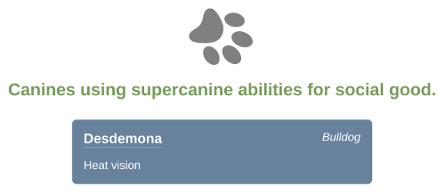

# Paws for Effect

This tutorial walks you through the basics of React development. By the end of it, you should have been exposed to:

 1. Creating simple components
 2. Using components inside other components
 3. Passing props to components
 4. Using JavaScript expressions inside JSX.
 5. Using `Array.map` to display a series of components.


## Install

After cloning this repo, from the repo's folder:

```shell
yarn
yarn start
```


## The App component

If you take a look at `index.html`, you'll see there's a single div with the id `app`. It's just there for React to bind with. In `client/index.js`, we find this:

```js
import App from './components/App'

document.addEventListener('DOMContentLoaded', () => {
  ReactDOM.render(
    <App/>,
    document.getElementById('app')
  )
})
```

Plain ol' `DOMContentLoaded`, like in Phase 0. So to start our React app off, we listen to make sure that the DOM has been loaded by the browser before _rendering_ our components (making them show up on the page).

Take a look at `client/components/App.jsx`:

```jsx
const App = () => (
  <div className='container'>
    
  </div>
)

export default App
```

Effectively this whole functional component is a `render` function. All it does is return some [markup](https://en.wikipedia.org/wiki/Markup_language), expressed as [JSX](https://jsx.github.io/). Instead of rendering a template, such as we do when using [Handlebars](https://handlebarsjs.com), we're dealing here with small chunks of the page at a time which are inserted into `index.html`. Each 'chunk' (component) can contain other components, some of which can be repeated to build lists of items on the page.


## The Dog component

Let's try another component. In your editor, make a new component called `Dog.jsx` and save it into the `client/components` directory:

```jsx
import React from 'react'

const Dog = props => {
  return (
    <div className='dog-wrapper'>
      <div className='dog'>
        <div className='dog-name-plate'>
          <span className='dog-name'>{props.name}</span>
          <span className='dog-breed'>{props.breed}</span>
        </div>
        <span className='dog-superpower'>{props.superpower}</span>
      </div>
    </div>
  )
}

export default Dog
```

Copy/paste will do for this one. Notice that it looks a lot like `App.jsx`, except there are a few extra tags and we're making use of _props_. The props come from what we would normally think of as 'attributes' on the component's tag in JSX:

```jsx
<Dog name='Desdemona' breed='Bulldog' superpower='Heat vision' />
```

Here, `name`, `breed`, and `superpower` are _props_. The `Dog` component will receive them as a JavaScript object like so:

```js
const props = {
  name: 'Desdemona',
  breed: 'Bulldog',
  superpower: 'Heat vision'
}
```

When we refer to a prop in JSX we have to put it inside curly braces, like so:

```jsx
<span>{props.name}</span>
```

Try it out! In `App.jsx`, import your new Dog component:

```js
import Dog from './Dog.jsx'
```

and add a Dog tag (use Desdemona, above if you like). The JSX returned should look something like this:

```jsx
(
  <div className='container'>
    
    <Dog name='Desdemona' breed='Bulldog' superpower='Heat vision' />
  </div>
)
```
> To understand why no explicit 'return' statement is needed here, check out MDN's docs on [Arrow functions](https://developer.mozilla.org/en-US/docs/Web/JavaScript/Reference/Functions/Arrow_functions).

You should see something like this in the browser:


> Try adding more dogs, right underneath the first one. Notice what happens when you don't provide one of the values?


## Moar components!

Try it yourself. Define a component called `Subtitle` that takes just one prop, `text`, and wraps it in `<h2>` tags. Import it in the App component and use it like so:

```jsx

<Subtitle text='Canines using supercanine abilities for social good.' />
<Dog name='Desdemona' breed='Bulldog' superpower='Heat vision' />
```

You should see something like this:



The `images` directory contains a few dog silhouettes. Try modifying the components to add an image for each `Dog`.

