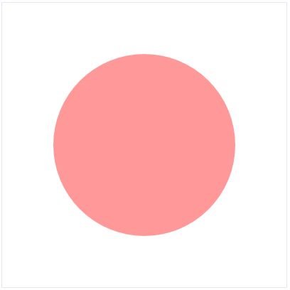

# Enspiraled

For this challenge, you'll be making a basic fractal generator that starts with a single large circle. As your mouse moves over the circle, four more circles appear. And each circle behaves this way.

## Setup

After cloning this repo

```sh
npm install
npm run dev
```

and then go to [`http://localhost:3000`](http://localhost:3000).

This is what your starting place looks like:



And after you've completed this project, this is what it can look like after a few mouse overs:


## Your starting place

Our journey begins in `client/components/App.jsx`. Here are its contents:

```jsx
import React from 'react'

const App = props => {
  const circle = {
    cx: props.width / 2,
    cy: props.height / 2,
    level: 0,
    r: 256
  }

  return (
    <svg width={props.width} height={props.height}>
      <circle cx={circle.cx} cy={circle.cy} r={circle.r} />
    </svg>
  )
}

export default App
```

The `App` component is implemented as a stateless functional component. The `props` are defined in `client/index.js` if you're curious. We use the width and height of the window to center the circle in the browser. This component renders [Scalable Vector Graphics](https://developer.mozilla.org/en-US/docs/Web/SVG): an `<svg>` element with an SVG `<circle>` element in it. It has a radius of 256px (`r`) and is filled with a translucent grey established in `public/css/app.css`. It's important to note that this JSX will render The SVG elements, _not React controls_. We know this because `<svg>` and `<circle>` are lower case.


## The requirements

* As your mouse moves over the circle, four more circles should appear at the cardinal compass points: north, south, east and west.

* The radius of the 4 new circles should be half of the _parent_ circle.

* A circle should only create 4 new _children_ **once**. Subsequent mouseovers should create no visible change.


## Some things to consider

Because every circle behaves the same way, you could create a new `Circle` component in `client/components/Circle.jsx` that wraps the SVG `<circle>` element and adds some new features (like state).

When a `<Circle>` is showing itself, it should use the SVG `<circle>` element, but when it's showing it's children, it should use new `<Circle>` components.

The `<Circle>` component should keep its child circles as an array in state. It will only have children if it has been moused over.

You can apply a mouseover event to the SVG `circle` element like so: `<circle cx={cx} cy={cy} r={r} mouseover={handleMouseOver} />`. The `handleMouseOver` function can be defined in the same `Circle.jsx` file.

Once you've got the functionality, have fun with new colours for each generation!

## Resources

If you don't already have it installed, you should install the React DevTools browser extension ([Firefox](https://addons.mozilla.org/en-US/firefox/addon/react-devtools/) and [Chrome](https://chrome.google.com/webstore/detail/react-developer-tools/fmkadmapgofadopljbjfkapdkoienihi?hl=en)). This will add a tab in Developer Tools that will allow you to explore the [virtual DOM](http://tonyfreed.com/blog/what_is_virtual_dom) used by React.

And some more:

* [SVG](https://developer.mozilla.org/en/docs/Web/SVG)
* [SVG `circle`](https://developer.mozilla.org/en-US/docs/Web/SVG/Element/circle)
* [React Component](https://facebook.github.io/react/docs/reusable-components.html#es6-classes)
* [React Component API](https://facebook.github.io/react/docs/component-api.html)
* [How State Works](https://facebook.github.io/react/docs/interactivity-and-dynamic-uis.html#how-state-works)
* [React's `setState`](https://facebook.github.io/react/docs/component-api.html#setstate)
* [React Event Handling](https://facebook.github.io/react/docs/interactivity-and-dynamic-uis.html#a-simple-example)
* [`ReactDOM.render`](https://facebook.github.io/react/docs/top-level-api.html#reactdom.render)
* [Color](https://developer.mozilla.org/en/docs/Web/CSS/color_value)
* [React TestUtils](https://facebook.github.io/react/docs/test-utils.html)

