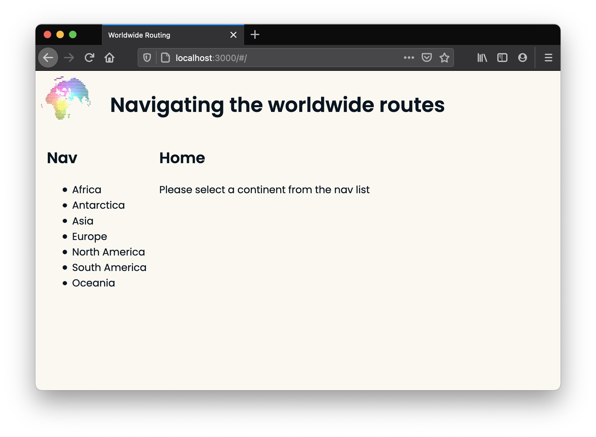
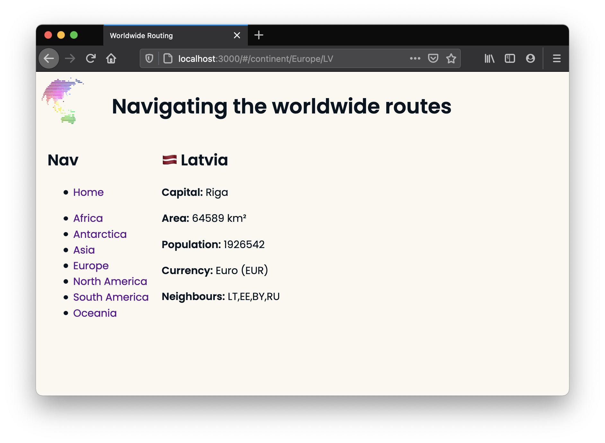
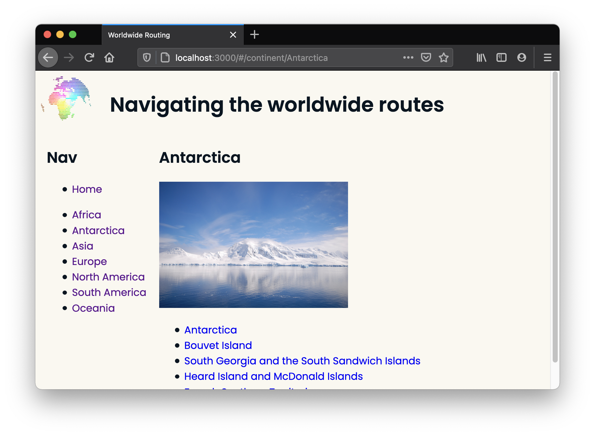
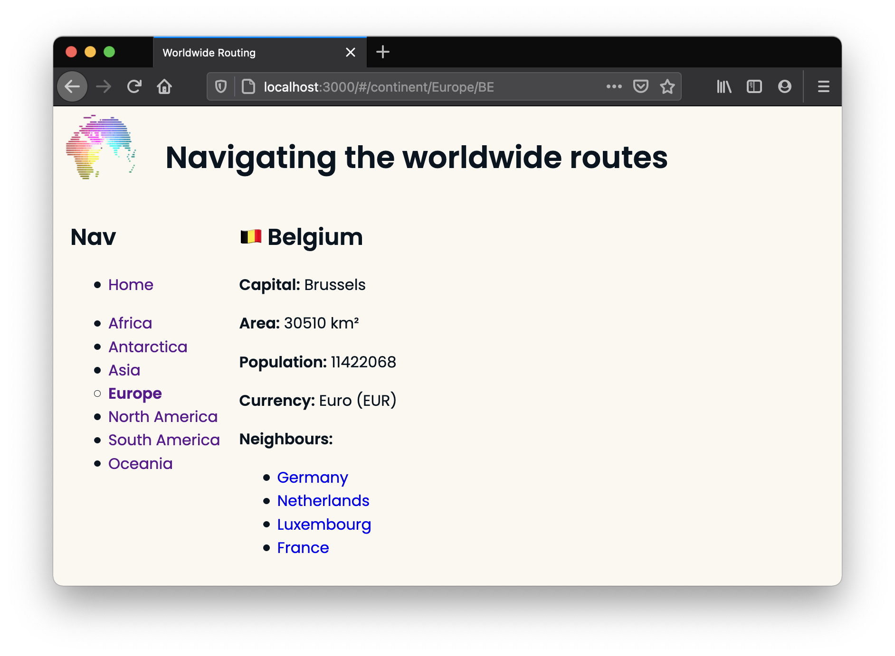

# Worldwide Routing

This exercise has you building an experience to navigate continents and their countries. We'll use [React Router](https://reactrouter.com/docs) to create the links and pages and manage browser history.


## Setup

After cloning this repo:

```sh
cd worldwide-routing
npm install
npm run dev
```

Add the configuration for `BrowserRouter` in your `server.js`.

```js
server.get('*', (req, res) => {
  res.sendFile(path.resolve('server/public/index.html'))
})
```

Set up `BrowserRouter` in your `client/index.js`. 

* Import the router from 'react-router-dom' at the top of the file. _i.e. `import { BrowserRouter as Router } from 'react-router-dom'`_

* Inside your `ReactDOM.render()` function, you can then wrap the `<App />` component in `<Router></Router>` tags. 

Note: _You could place the router within the App instead, around specific components, but by wrapping it around App we will give everything access to the Router's functionality._


## Release 1

Let's start with the couple of components that make up the home page. Check out the `App.jsx` component. It currently contains the main header as shown in the following image, the instructions are in a `Home` component, and the beginnings of the `Nav` component are also in place.

 * Start by completing the `Nav` component so that it contains a list of continent names (like in the image below) based on the information from `data/continents`.  Add a list item for Home too.

 Tip: _You can use `Object.keys()` on what is exported from `data/continents.js` to get a list of continent names._

 * Import and then use the `Routes` and `Route` components from `react-router-dom`, so that the `Home` component will only show on `'/'`. We want the `Nav` component to show on all pages, so it can sit outside the `Routes` component.




## Release 2

Next, add a route for `/continents/:name` to your `App.jsx`. We will use it to show the selected continent and its respective image from `data/continents.js` file. 

* Create a `Continent` component for this route. Import `useParams` from `react-router-dom` and then use this to determine which continent to show. 

* Use the `Link` component from `react-router-dom` in your `Nav` to create links for the user to the correct continent.

* In the `Continent` component, also show a list of countries that the given continent contains.

Notice how `Continent` has replaced the `Home` component in the image below.


## Release 3

In this release, we'll create a component for an individual country. This is the first time you'll need to use `data/countries.js`.

* Create a route for this page. It should look something like: `/continent/:name/:code`. 

Note: _We're using the continent name and country code for this route to help us later. The url path for the above suggestion will be entered into the browser as `/continent/Oceania/NZ`_

* This route should render a `Country` component that shows all the information (in `data/countries`) about that specific country. 



* Make sure the country list in `Continent` can link to the page you've just created (remember that `Link` component).




## Release 4

Currently each country just shows a string of it's neighbours' country codes. Create a list that will show each neighbour's name instead and be a link to that country's page so you can visit the pages of neighbours easily.




## Future Releases

Here are some ideas for future releases:

* If you haven't already, add a _Home_ link in the `Nav` component.

* Bold the selected continent in the `Nav` when viewing a continent or country and/or change the bullet point style (as shown in the release 4 screenshot) so users will know where they are.

* Countries currently show up in the order decided by the data files. Add a feature to show them alphabetically or perhaps even by population.

* Think about a different way you could navigate around this data and implement it in a different branch.
