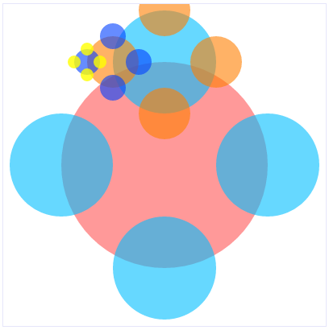
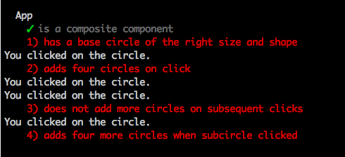

# Enspiraled

For this challenge, you'll be making a basic fractal generator that starts with a single large circle. Click on the circle and four new circles of half the original circle's radius will appear at the cardinal compass points, north, south, east and west. Click on any of those circles and the process is repeated.

## Setup

Here is the base state at load:


And here is what it should look like after a few clicks:



Colors are unimportant; choose your own. The initial size of the canvas should be 800 by 800, and the radius of the initial, centered circle should be 256 pixels, if you want it to look like the above images. Or choose your own.

Here you'll find a browserify app all set up and ready to get started. Just clone this repo, then run:

```sh
npm install
npm run build
```

This will build your app and run watchify to rebuild it whenever you change your JavaScript code in the `src` folder. Then open a new terminal window in the same project folder and run `npm start` to start the webserver on port 8008: [http://localhost:8008/](http://localhost:8008/). You can now load the page in your browser. Use Control-C to stop watchify and/or the server.

The `src/index.jsx` file looks like this:

```jsx
import React from 'react'
import ReactDOM from 'react-dom'

import App from './components/app.jsx!'

const app = document.createElement('div')

document.body.appendChild(app)

ReactDOM.render(<App/>, app)
```

This imports React and the ReactDOM. The latter is used to render the application into a `<div>` element appended to the body. We create a new `<div>` element, append it to the document's `<body>`, and then render the React App into it. Note that we import our App component and then use it as if it were an HTML element: `<App/>` (that closing slash is important&mdash;use it on any JSX tag that doesn't have a closing tag).

Here is the `src/components/app.jsx` file:

```jsx
import React, { Component } from 'react'

class App extends Component {

  render () {
    return <svg>
      <circle cx={50} cy={50} r={10} fill="red" />
    </svg>
  }
}

export default App
```

We import `Component` from React using destructuring assignment (Google it), then we extend the React Component to create our own App component. This gives us React superpowers. Then we write our own `render` method. React will call this automatically whenever it wants to render this component, and whatever we return will be processed into HTML and rendered to the window.

Here we're rendering some SVG (Scalable Vector Graphics). It draws a circle with the center 50px from the top (`cy`) and 50px from the left (`cx`) of the parent element. The circle has a radius of 10px (`r`) and is filled with red (`fill`).

Your job is to create a new Circle component in `src/components/circle.jsx` that wraps this SVG element and adds some new features. The most important of these is an onClick property. You'll want to pass a click handling method into your Circles and then pass the center and radius back to the App, which will use that information to add the four new circles *if they don't already exist*.

We've also included some tests. You can see them in `test/tests.js` and you can run them by running:

```sh
npm test
```

Maybe in a third terminal tab?

You should see some failing tests, like this:



Your task: make these tests pass and create an output that looks something like the ones in the images above.

## Hints

If you don't already have it installed, you might like to add the [React plugin](https://chrome.google.com/webstore/detail/react-developer-tools/fmkadmapgofadopljbjfkapdkoienihi?hl=en) to Chrome. This will add a tab in Developer Tools that will allow you to explore the [virtual DOM](http://tonyfreed.com/blog/what_is_virtual_dom) created by React.

These resources might be useful:

- [SVG](https://developer.mozilla.org/en/docs/Web/SVG)
- [`circle`](https://developer.mozilla.org/en-US/docs/Web/SVG/Element/circle)
- [`import`](https://developer.mozilla.org/en-US/docs/Web/JavaScript/Reference/Statements/import)
- [Destructuring assignment](https://developer.mozilla.org/en/docs/Web/JavaScript/Reference/Operators/Destructuring_assignment)
- [`const`](https://developer.mozilla.org/en-US/docs/Web/JavaScript/Reference/Statements/const) variables are mutable!
- [`let`](https://developer.mozilla.org/en/docs/Web/JavaScript/Reference/Statements/let)
- [`export`](https://developer.mozilla.org/en-US/docs/Web/JavaScript/Reference/Statements/export)
- [React Component](https://facebook.github.io/react/docs/reusable-components.html#es6-classes)
- [React Component API](https://facebook.github.io/react/docs/component-api.html)
- [How State Works](https://facebook.github.io/react/docs/interactivity-and-dynamic-uis.html#how-state-works)
- [`setState`](https://facebook.github.io/react/docs/component-api.html#setstate)
- [React Event Handling](https://facebook.github.io/react/docs/interactivity-and-dynamic-uis.html#a-simple-example)
- [`ReactDOM.render`](https://facebook.github.io/react/docs/top-level-api.html#reactdom.render)
- [Color](https://developer.mozilla.org/en/docs/Web/CSS/color_value)
- [React TestUtils](https://facebook.github.io/react/docs/test-utils.html)
- [Mocha](https://mochajs.org/)
- [Chai BDD API](http://chaijs.com/api/bdd/)
- [Ramda](http://ramdajs.com/docs/)
- [browserify](http://browserify.org/)
- [watchify](http://spapas.github.io/2015/05/27/using-browserify-watchify/)

