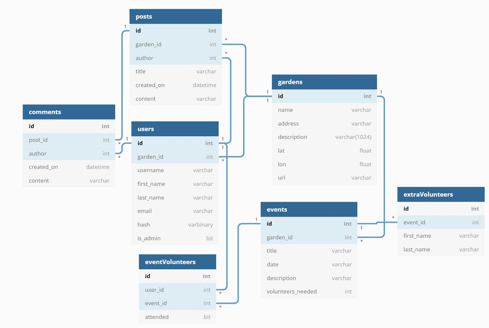

# Database schema


[Gardenz ERD on dbdiagram.io](https://dbdiagram.io/d/5f61c9407da1ea736e2e0bda)


Updated code for ERD:
```
 // Creating tables
Table users  {
  id int [pk, increment] // auto-increment
  garden_id int
  username varchar
  first_name varchar
  last_name varchar
  email varchar
  hash varbinary
  is_admin bit
}

Table gardens {
  id int [pk]
  name varchar
  address varchar
  description varchar(1024)
  lat float
  lon float
  url varchar
}

Table posts {
  id int [pk]
  garden_id int
  author int
  title varchar
  created_on datetime
  content varchar
}

Table comments {
  id int [pk]
  post_id int
  author int
  created_on datetime
  content varchar
}

Table events {
  id int [pk]
  garden_id int
  title varchar
  date varchar
  description varchar
  volunteers_needed int
}

Table eventVolunteers {
  id int [pk]
  user_id int
  event_id int
  attended bit
}

Table extraVolunteers {
  id int [pk]
  event_id int
  first_name varchar
  last_name varchar
}

// Creating references
// You can also define relaionship separately
// > many-to-one; < one-to-many; - one-to-one
Ref: users.garden_id > gardens.id
Ref: events.garden_id > gardens.id
Ref: eventVolunteers.user_id > users.id
Ref: eventVolunteers.event_id > events.id
Ref: extraVolunteers.event_id > events.id
Ref: posts.garden_id > gardens.id
Ref: comments.post_id > posts.id
Ref: comments.author > users.id
Ref: posts.author > users.id
```